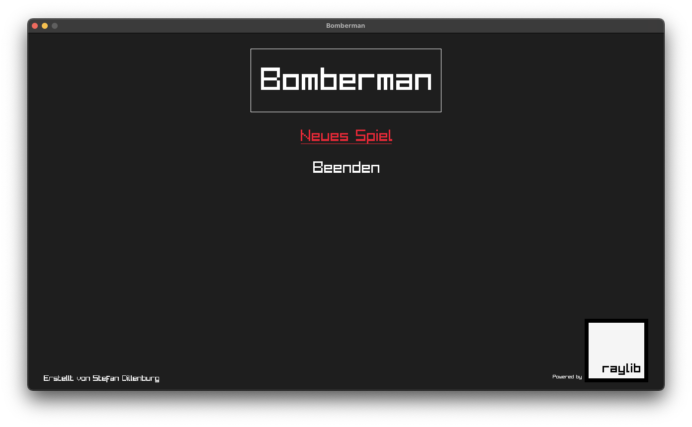
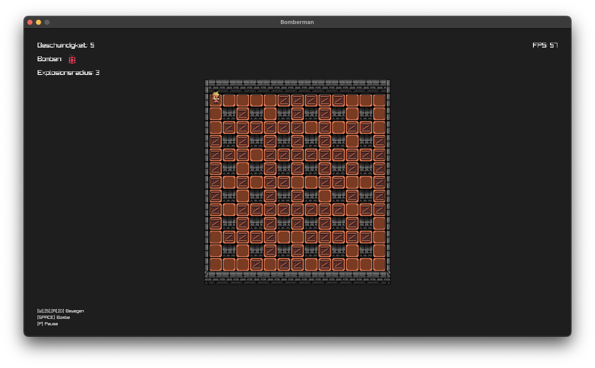

# Bomberman

> [!WARNING]
> This project is unfinished so keep your expectations low.
> It will be updated/continued on the fly, so there is no guarantee to be working.

The project aims to help me understand game development.
It is inspired by a flash game I used to play as a kid [Bomberpengu](https://bomberman.fandom.com/de/wiki/BomberPengu).

  

  

## Features

- [ ] Enemy AI
- [ ] Multiplayer
- [x] Player Movement
- [x] Bombs
- [x] Power-Up's (Speed, Blast-Radius, Bombs)

## Acknowledgements

- [Raylib](https://github.com/raysan5/raylib) Thanks to [raysan5](https://github.com/raysan5) for this wonderful library.

## Disclaimer

This game is in no way affiliated with the original Bomberman game or its trademark rights.
It is an independent development that makes no claim to the use of the Bomberman brand name or intellectual property.
All rights to the original Bomberman trademarks and content belong to their respective owners.

